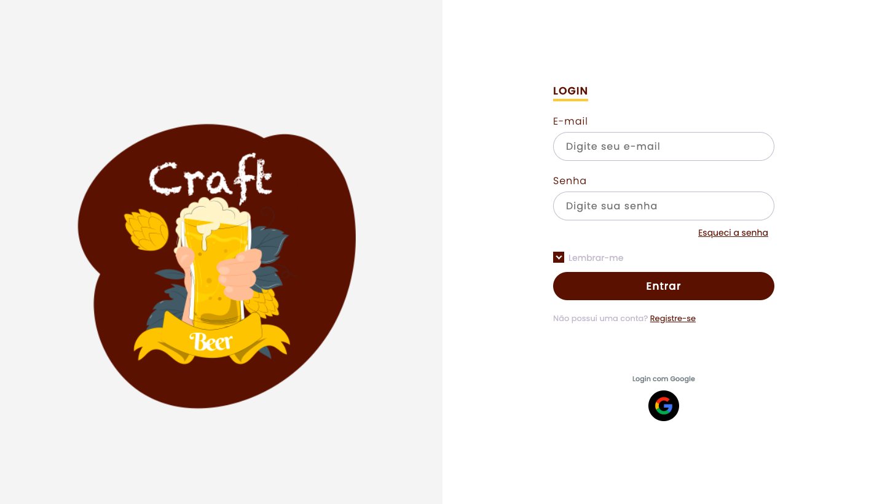
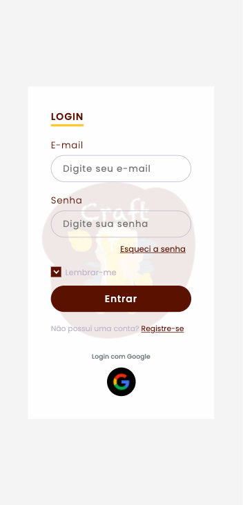

# Login Page Challenge

The intent of this project was practice html and css. This is a static page, and you can visit it [here](https://raquelmichelon.github.io/LoginPage/)

## 🚀 Responsive layout

The responsive layout, which is the adaptability of the elements, allows the user interact with the page in a computer or smartphone.

## 🛠️ Built with

* [HTML5](https://www.w3schools.com/html/)
* [CSS](https://www.w3schools.com/css/)

---
⌨️ com ❤️ por [Raquel Darelli Michelon](https://github.com/RaquelMichelon) 😊
